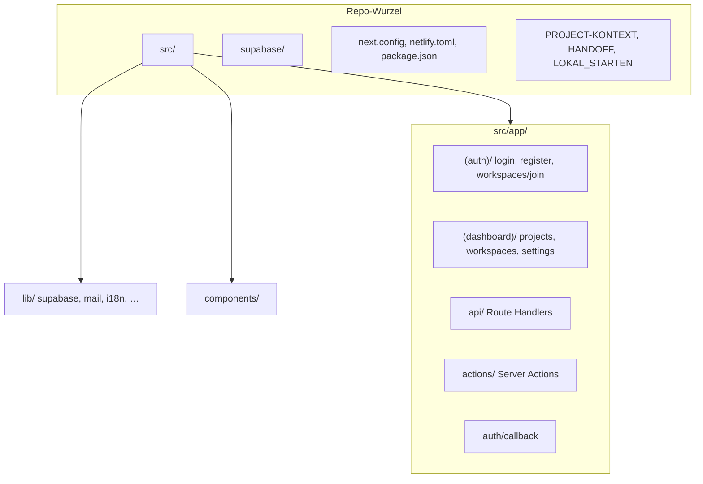

# PRIDE – Repo-Struktur (Orientierung für Menschen & KI)

Kurze Landkarte des Repos `pride-project`. **Keine Secrets** – Zugangsdaten nur in `.env.local`, Netlify oder Supabase.

---

## Baum (überblick)

```text
PRIDE (pride-project) – Repo-Struktur

Wurzel
├── src/                          # gesamte Next.js 15 App (App Router)
│   ├── app/
│   │   ├── (auth)/               # Login, Register, Workspaces beitreten (ohne Dashboard-Shell)
│   │   ├── (dashboard)/          # Projekte, Workspaces, Einstellungen (eingeloggt)
│   │   ├── auth/callback/        # Supabase Callback (PKCE / Session)
│   │   ├── api/                  # Route Handlers (REST) – kein UI
│   │   ├── layout.tsx, page.tsx, error.tsx, globals.css
│   │   └── actions/              # Server Actions (DB/Auth)
│   ├── components/               # UI (layout/, projects/, workspaces/, settings/, …)
│   ├── lib/                      # Hilfen: supabase/, mail.ts, i18n.ts, appEdition.ts, …
│   ├── types/                    # z. B. database.ts
│   └── middleware.ts
├── supabase/
│   ├── migrations/               # nummerierte SQL-Migrationen (Reihenfolge beachten)
│   └── *.sql                     # ggf. manuell im SQL Editor (RUN_IN_…, Sammeldateien)
├── public/                       # statische Assets
├── netlify.toml
├── next.config.ts
├── tailwind.config.ts
├── package.json
├── PROJECT-KONTEXT.md            # Stack, Features, Pfade
├── HANDOFF_FUER_NEUEN_CHAT.md    # Übergabe, Stolperfallen PRIDE/Handwerker
├── NEUER_CHAT_START.md
└── LOKAL_STARTEN.md
```

---

## `src/app/api/` (Auswahl)

| Bereich | Beispiele |
|--------|-----------|
| `auth/` | `sign-in`, `sign-up`, `signout`, `register-invite`, `supabase-reachability` |
| `workspaces/` | `invite`, `invite-preview`, `accept-invite`, `create`, `[workspaceId]/…` |
| `invites/` | `validate`, `accept` |
| Sonstiges | `files/`, `photos/`, `project-labels`, `app-edition` |

---

## `src/app/actions/` (Server Actions)

| Datei | Thema |
|-------|--------|
| `projects.ts` | Projekte |
| `workspaces.ts` | Workspaces, Mitglieder, … |
| `invites.ts` | Staff-Einladungen (wo genutzt) |
| `staff.ts` | Mitarbeiter |
| `photos.ts` | Fotos |
| `categories.ts` | Kategorien |
| `workspaceProjectLabels.ts` | Workspace-Überschriften |

---

## Hinweise für Automatisierung / neuen Chat

- **Zwei Deployments (PRIDE + Handwerker):** gleiche Codebasis, **eigene** Netlify-Site und **eigene** Env – nicht vermischen (siehe `HANDOFF_FUER_NEUEN_CHAT.md`, Abschnitt „Stolperfallen“).
- **Secrets** nie ins Repo oder in den Chat.
- Details zu Produkt und Konventionen: **`PROJECT-KONTEXT.md`**.

---

## Diagramm (optional)



*Zuletzt ergänzt: Repo-Landkarte für Übergabe an andere Chats/KIs.*
